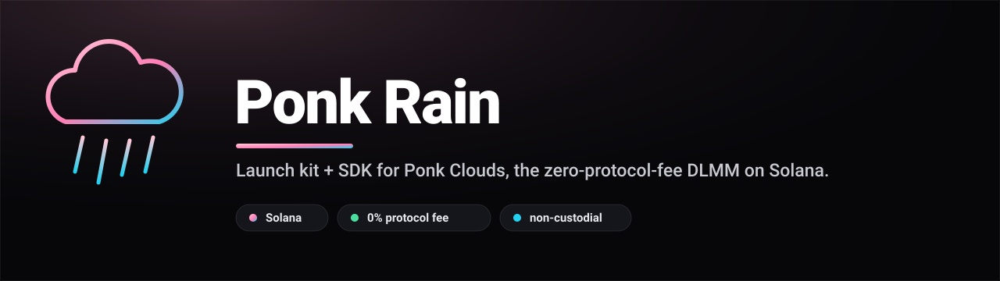
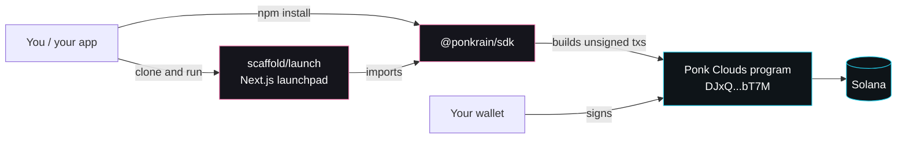
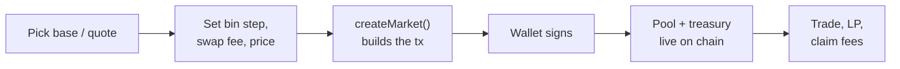

<p align="center">
  
</p>

<p align="center">
  <strong>The launch kit and SDK for <a href="https://ponk.exchange">Ponk Clouds</a>, PONK's bin-based DLMM AMM on Solana with zero protocol fee at the AMM level.</strong>
</p>

<p align="center">
  
  
  
  
  
  
</p>

<p align="center">
  <a href="#quickstart">Quickstart</a> &middot;
  <a href="#monorepo-layout">Monorepo</a> &middot;
  <a href="docs/index.md">Docs</a> &middot;
  <a href="packages/sdk/README.md">SDK</a> &middot;
  <a href="scaffold/launch/README.md">Launchpad</a> &middot;
  <a href="CONTRIBUTING.md">Contributing</a>
</p>

---

Ponk Rain is everything you need to launch a concentrated-liquidity market, seed
it with liquidity, trade against it, and read its on-chain state, driven entirely
from a wallet over `@solana/web3.js`. It wraps the real, deployed Ponk Clouds
program at `DJxQvbEtBFngkmtpEcB41Y4qv4apUFsqUvZvG7AHbT7M` so you never have to
re-derive the byte layout, the PDA seeds, or the swap math by hand.

> [!NOTE]
> ponk.exchange was assessed by zauth (Vector) on 29 September 2026: a deep scan
> across 51 endpoints, 5 subdomains and 58 input vectors, every finding verified
> by browser-based proof of concept. 12 findings, no critical. The report is
> published in full at https://ponk.exchange/docs/audits
>
> Test against a local validator or devnet before you deploy capital, as you
> would with any on-chain program.
>
> The ponk.exchange web application, API and MCP server were assessed separately
> by zauth (Vector) on 29 September 2026, published in full at
> [ponk.exchange/docs/audits](https://ponk.exchange/docs/audits). That assessment
> did not read this program and says nothing about its bin math, its swap
> accounting or its vault invariants.

## How it fits together



The SDK never holds keys and never signs. It derives the accounts, encodes the
instructions, and hands you an unsigned transaction; your wallet signs it. The
scaffold is just a polished front end over the same SDK calls.

**Launch flow, end to end:**



## What is Ponk Clouds

Ponk Clouds is a bin-based DLMM (Discretized Liquidity Market Maker) AMM, in the
same family as Meteora DLMM. Instead of a single constant-product curve,
liquidity is sliced into discrete price **bins**. Each bin holds reserves at a
fixed price and trades along a constant-sum curve, so within a bin there is zero
slippage; price only moves as a swap walks from one bin to the next. Liquidity
providers choose exactly which bins (which price range) to fund, giving the
capital efficiency of concentrated liquidity.

The defining property is the fee model:

- **Zero protocol fee at the AMM level.** The program itself takes no cut of the
  trade. The entire swap fee is set per pool by the pool creator.
- That swap fee is split three ways: the pool **creator's** cut (bps OF the swap
  fee, capped so creators can never take the whole fee and LPs always keep at
  least half), a small flat **platform treasury** cut (default 1% of the swap
  fee), and the remainder to **LPs**. With a creator cut of 0, LPs keep 100% of
  the swap fee minus that treasury cut.

Because the protocol cut lives in bps OF the swap fee rather than of the trade,
real numbers are tiny: a 4 bps swap fee with a 300 bps creator cut works out to
about 0.0012% of each trade. The kit surfaces these honestly everywhere rather
than overstating them.

Key on-chain parameters the kit respects, ported verbatim from the program:

| Parameter | Value | Meaning |
| --- | --- | --- |
| Program id | `DJxQvbEtBFngkmtpEcB41Y4qv4apUFsqUvZvG7AHbT7M` | The deployed Ponk Clouds program |
| Bins per array | 70 | Each `BinArray` is a 70-bin price window |
| Max swap fee | 1000 bps | Hard cap a creator can set as the swap fee |
| Max protocol fee | 5000 bps | Cap on the creator's cut OF the swap fee (LPs keep >= half) |
| Max treasury fee | 5000 bps | Cap on the platform cut OF the swap fee |
| Default treasury fee | 100 bps | 1% of the swap fee, to the PONK treasury, by default |
| Max bins per swap | 28 | Compute-bounded walk limit per swap |
| Max bin arrays per swap | 2 | The named array plus one remaining array (140 contiguous bins) |

These come straight from the program's `lib.rs` and `state.rs`, and from the
`clouds-math` reference crate, so an off-chain quote built with the SDK matches
the on-chain result.

## What's in the box

Ponk Rain is a pnpm workspace with two members:

- **`@ponkrain/sdk`** ([`packages/sdk`](packages/sdk)) - the env-agnostic
  TypeScript SDK. PDA derivation, account decoders, exact off-chain swap and
  liquidity math that matches the chain bit-for-bit, and raw `@solana/web3.js`
  transaction builders for the full lifecycle: launch a market, swap,
  open/add/remove/close LP positions, and claim creator and treasury fees. Its
  only dependency is `@solana/web3.js`; no Anchor at runtime. The high-level
  entry point is `RainClient`.
- **`@ponkrain/launch`** ([`scaffold/launch`](scaffold/launch)) - the
  clone-and-run Next.js 14 launchpad and market UI, built entirely on
  `@ponkrain/sdk`. Explore and sort live pools, launch a new market, trade with a
  live price chart and trade tape, manage liquidity around the active bin, and
  track a wallet's portfolio. Fork it, point it at your own RPC and indexer, and
  ship.

Two design rules run through the whole kit:

- **Non-custodial.** Every mutating SDK call returns unsigned instructions or a
  `Transaction`. The SDK never holds, derives, or asks for a private key. You
  sign with your own wallet or keypair.
- **No fabrication.** On-chain reads return real values or `null`/`0`. Empty bins
  read as zero reserves, not guesses. Where an indexed value is genuinely unknown
  the UI renders `--`. There are no "coming soon" controls and no mocked data
  anywhere in the kit.

## Quickstart

Prerequisites: **Node >= 20** (pinned via `.nvmrc`) and **pnpm 9+** (the
workspace declares `packageManager: pnpm@9.7.0`; the simplest way to get it is
Corepack, which ships with Node).

```bash
# 1. Install once from the repo root (this is a pnpm workspace).
corepack enable
pnpm install

# 2. Build the SDK (required before a production app build).
pnpm --filter @ponkrain/sdk run build

# 3. Configure the app.
cp scaffold/launch/.env.example scaffold/launch/.env.local
#    then edit NEXT_PUBLIC_PONK_CLOUDS_RPC / API URLs for your setup

# 4. Run the launchpad on http://localhost:3100.
pnpm --filter @ponkrain/launch run dev
```

Install from the **repo root**, not from inside `scaffold/launch`: the workspace
link (`@ponkrain/sdk: "workspace:*"`) only resolves correctly from the root.

Want to launch a market, in the UI or from a Node script with the SDK directly?
See [docs/launch-a-market.md](docs/launch-a-market.md). For the full setup,
including pointing at a local validator and the env reference, see
[docs/quickstart.md](docs/quickstart.md).

## SDK at a glance

```ts
import { Connection, Keypair, Transaction } from "@solana/web3.js";
import { RainClient, computeActiveBinId } from "@ponkrain/sdk";

const connection = new Connection("http://127.0.0.1:8899", "confirmed");
const client = new RainClient({ connection });
const wallet = Keypair.fromSecretKey(/* ... */);

// Resolve a human price (quote per base) to the active bin the program stores.
const activeBinId = computeActiveBinId(150, /* binStep */ 4, /* decX */ 9, /* decY */ 6);
if (activeBinId === null) throw new Error("invalid initial price");

// Build the launch transactions (nothing is signed or sent for you).
const { ixs, treasuryIx, pool } = client.rain({
  authority: wallet.publicKey,
  mintX: SOL,            // base
  mintY: USDC,           // quote (order is NOT canonicalized, it is your choice)
  binStep: 4,            // bps; part of the pool address
  swapFeeBps: 4,         // 4 bps swap fee
  protocolFeeBps: 2000,  // your creator cut: 20% OF the swap fee
  activeBinId,
});

const tx = new Transaction().add(...ixs);
await client.sendAndConfirm(tx, async (t) => (t.partialSign(wallet), t));
```

The full `RainClient` reference and the lower-level module API live in
[packages/sdk/README.md](packages/sdk/README.md).

## Monorepo layout

```
ponk-rain/
  package.json            Workspace root: build / dev / typecheck / lint scripts
  pnpm-workspace.yaml      Workspace globs: packages/* and scaffold/*
  tsconfig.base.json       Shared strict TypeScript base config
  LICENSE                  Apache-2.0
  docs/                    Project documentation (index, quickstart, concepts, launch-a-market)
  packages/
    sdk/                   @ponkrain/sdk - the TypeScript SDK
      src/
        constants.ts        Program id, addresses, discriminators, magic numbers
        version.ts          Dependency-free SDK version / build metadata
        idl/
          ponk_clouds.ts    Anchor IDL data export + error-code map
        pda.ts              PDA and ATA derivation (pool, bin array, position, treasury, vault)
        codec.ts            Little-endian byte encode/decode helpers
        types.ts            Public TypeScript interfaces and type aliases
        math/
          price.ts          Bin pricing (display floats + exact Q64.64 integer)
          swap.ts           Exact swap math: within-bin fill + cross-bin walk
          liquidity.ts      Exact deposit/withdraw share math + range planner
          index.ts          Math module barrel
        pool.ts             Decode and read/discover pool state from chain
        rain/
          createPool.ts     Build the market-launch transactions (the "Rain" flow)
          index.ts          Rain module barrel
        swap.ts             Build and quote swap transactions
        position.ts         Open/fund/close LP positions, wSOL helpers
        fees.ts             Authority-only fee-claim transactions and reads
        confirm.ts          Send/confirm helpers (status polling, tx packing)
        client.ts           RainClient: the high-level entry point
        index.ts            Public barrel re-export
  scaffold/
    launch/                @ponkrain/launch - the Next.js launchpad and market UI
```

The on-chain program itself lives in a separate repo (`ponk-clouds`): the Anchor
program (`programs/ponk-clouds/src/lib.rs`, `state.rs`) and the pure
`clouds-math` crate (`price`, `swap`, `liquidity`, `router`). The SDK ports those
values and math faithfully so this kit and the chain agree.

## Workspace scripts

Run these from the repo root. The `-r` flag runs across every workspace member.

| Command | What it does |
| --- | --- |
| `pnpm install` | Install all dependencies and link the workspace SDK. |
| `pnpm run build` | Build the SDK, then the scaffold, in dependency order. |
| `pnpm run dev` | Run every member's `dev` script in parallel (SDK watch build + app dev server). |
| `pnpm run typecheck` | `tsc --noEmit` across the workspace. |
| `pnpm run lint` | Lint across the workspace. |
| `pnpm run clean` | Remove build artifacts (`dist`, `.next`, `out`, `*.tsbuildinfo`). |
| `pnpm --filter @ponkrain/sdk run build` | Build only the SDK. |
| `pnpm --filter @ponkrain/launch run dev` | Run only the app dev server. |

## Documentation

- [docs/index.md](docs/index.md) - project overview, audience, and the honesty
  and safety guarantees that govern the kit.
- [docs/quickstart.md](docs/quickstart.md) - clone, install, configure, run, and
  build, plus pointing at a local validator.
- [docs/launch-a-market.md](docs/launch-a-market.md) - end-to-end tutorial:
  launch a market, seed liquidity, and swap, both in the UI and with the SDK
  directly.
- [docs/concepts.md](docs/concepts.md) - the ideas behind the market: DLMM bins,
  bin step, the fee split, the zero-protocol-fee model, and the non-custodial
  design.
- [packages/sdk/README.md](packages/sdk/README.md) - the full SDK reference and
  the `RainClient` API.
- [scaffold/launch/README.md](scaffold/launch/README.md) - the launchpad app:
  pages, configuration, and deploy.

## Who it's for

- **Token teams and creators** who want a real DLMM market for a token in
  minutes: fork `@ponkrain/launch`, set the bin step, swap fee, creator cut, and
  initial price, and have a working trade and liquidity UI from the first commit.
- **Frontend and product developers** building a custom trading or liquidity
  interface who want the on-chain plumbing solved: depend on `@ponkrain/sdk`, call
  `RainClient`, and own the UX while keeping custody of signing.
- **Liquidity providers and integrators** who need to read pool, bin, and
  position state, compute exact quotes and deposit previews off-chain, and plan a
  liquidity range (spot / curve / bidask / full) around the active bin.
- **Bot and infrastructure builders** who want a small, dependency-light Node
  library to derive addresses, decode accounts, quote swaps, and build raw
  transactions, with send/confirm helpers that poll signature status instead of
  trusting a dropped WebSocket confirmation.

## Contributing

See [CONTRIBUTING.md](CONTRIBUTING.md) for how the kit is built, the rules every
change follows (honesty, no placeholders, on-chain parity), and the local
checks to run before you open a change.

## License

[Apache-2.0](LICENSE).
